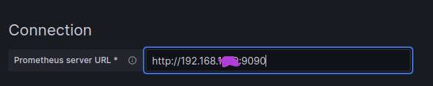
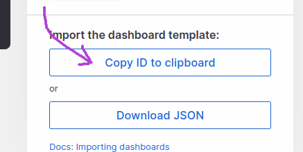

## Grafana

Grafana отображает данные собранные prometheus

Страница Grafana: http://localhost:3000

#### крэдлы по умолчанию

username: admin

password: admin

#### добавляем источник данных который будет prometheus

создаём панель мониторинга:

Уже сделанные кем-то панели: https://grafana.com/grafana/dashboards/

Буду использовать эту: https://grafana.com/grafana/dashboards/1860-node-exporter-full/

после внесения изменеий в работе дашборда(отображать информацию за последние 5мин, обновляя её каждые 5с),
нужно нажать на сохранить:

## Prometheus

Prometheus собирает данные из разных источников(экспортёров), делает http-запросы к экспортёрам.
Чтобы prometheus мог удачно их получить, экспортёры должны предоставлять эти метрики по http-запросу,
обычно по ***http://<exporter_hos>/metrics***

В конфинурационном файле config/prometheus.yaml указываем источники данных, откуда прометеус будет их брать к себе 

Страница Prometheus: http://localhost:9090

открыть список экспортёров:

## node exporter

node exporter - источник данных(экспортёр), который собирает метрики о системе(пямять, процессор и т.п.).
Потом эти метрики заберает к себе prometheus

https://github.com/prometheus/node_exporter

Страница node exporter: http://localhost:9100

## cadvisor

cadvisor - соберает метрики docker контейнеров
